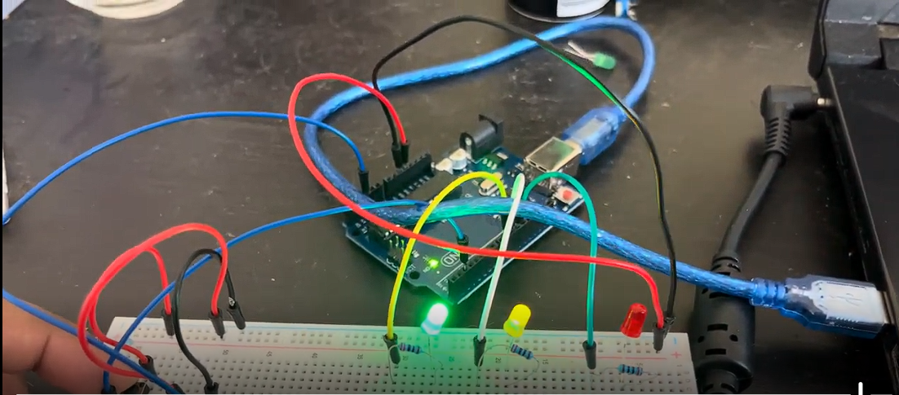

# Multitasking with 3 LEDs

I used serial inputs to change the blink rate of one LED, a potentiometer to change the intensity of another and the use of a button to turn a third LED on and off.

## Video Demonstration

Click the thumbnail below:

